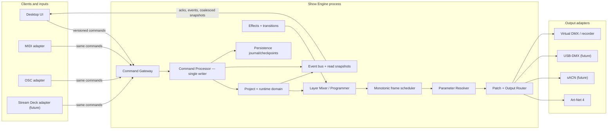
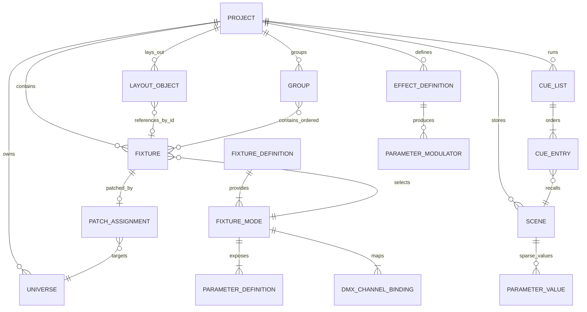

# Technická architektúra profesionálneho DMX lighting controllera

**Stav:** schválený architektonický baseline
**Verzia dokumentu:** 0.2
**Dátum:** 2026-08-08
**Primárny cieľ:** macOS MVP, od začiatku pripravené na Windows

## Executive recommendation

Najdôležitejšie rozhodnutie nie je UI framework, ale hranica systému:

> `UI / MIDI / OSC → Commands → logický FixtureState → Show Engine → Parameter Resolver → DMX frames → Output adapters`

UI nikdy nevlastní ani negeneruje DMX frame. Od MVP 1 odporúčam Show Engine ako **samostatný lokálny proces** so stabilným, verzovaným IPC kontraktom. Freeze alebo pád UI tak nezastaví Art-Net. Engine používa posledný platný show state, kým sa UI znovu pripojí. Blackout je atomický safety flag aplikovaný v engine ako posledný krok pred výstupom; nemení scény ani programmer state.

Schválený stack je **Rust + Tauri 2 + React/TypeScript**, s Rust engine sidecarom a hybridným Stage Editorom (PixiJS/WebGL plus DOM overlay). MVP 0 musí rozhodnutie validovať timing/Art-Net prototypom a renderer benchmarkom na 100–300 fixtures, 4–16 universes a realistickom počte stage objektov.

Fixture knižnica používa **kanonický interný JSON model**, predpripravený offline balík skonvertovaný z Open Fixture Library a Custom Fixture Editor. GDTF 1.2 import príde neskôr. Engine nikdy priamo nepracuje s OFL JSON ani GDTF XML; všetky zdroje sa normalizujú do immutable interného modelu.

---

## A. Odporúčaný technologický stack

### Cesta 1 — Rust engine + Tauri 2 + React/TypeScript

**Zloženie**

- `show-engine`: samostatný Rust proces a sada čistých Rust crates.
- Desktop shell: Tauri 2.
- UI: React + TypeScript.
- Bežné UI: Radix/shadcn princípy, Tailwind alebo CSS modules/tokens.
- Stage Editor: PixiJS/WebGL s DOM overlayom.
- IPC: lokálny socket alebo Tauri sidecar IPC; binárne snapshoty cez MessagePack/Protobuf, príkazy môžu začať ako versioned JSON.

| Kritérium | Hodnotenie |
|---|---|
| Real-time DMX | Výborné. Rust engine je mimo JS event loopu, bez GC stop-the-world. |
| 2D rendering | Veľmi dobrý ekosystém pre Canvas/WebGL; panely ostávajú v Reacte. |
| macOS/Windows | Silné, ale treba testovať rozdiel WKWebView vs. WebView2. Tauri používa systémový webview, nie rovnaký prehliadač na oboch OS. |
| Maintainability | Dobrá pri čistom kontrakte; nevýhodou sú dva jazyky a IPC. |
| Vibe coding / AI | Najlepšie zo všetkých možností: React/TS je veľmi dobre pokrytý, Rust typy pomáhajú zachytiť chyby. |
| Riziká | Webview rozdiely, packaging sidecaru, potreba disciplíny aby sa show logika nepresunula do UI. |

Tauri kombinuje Rust backend s HTML UI a správami cez bridge; na macOS používa WKWebView a na Windows WebView2. To je dôvod, prečo DMX timing nesmie závisieť od webview a prečo treba UI regression testy na oboch platformách. Pozri [Tauri architecture](https://v1.tauri.app/v1/references/architecture/) a [Tauri webview versions](https://v2.tauri.app/reference/webview-versions/).

**Kedy ju vybrať:** malý až stredný tím, vysoká priorita moderného UX a rýchlych iterácií, ochota používať Rust pre jadro.

### Cesta 2 — C++20 + Qt 6/QML/Qt Quick

**Zloženie**

- Engine a doména v C++20, ideálne stále ako samostatný proces.
- Qt Quick/QML pre UI.
- Qt Quick Scene Graph alebo custom `QQuickItem` pre Stage Editor.
- Qt Network pre UDP; adaptér pre MIDI/USB podľa platformy.

| Kritérium | Hodnotenie |
|---|---|
| Real-time DMX | Výborné a veľmi predvídateľné, ak frame loop nealokuje a neblokuje. |
| 2D rendering | Výborné. Qt Quick používa GPU scene graph; Qt RHI mapuje na Metal/Direct3D/Vulkan/OpenGL. |
| macOS/Windows | Najzrelšia desktopová cesta z týchto troch. |
| Maintainability | Dobrá pre skúsený C++/Qt tím, drahšia pre malý tím; memory-safety a build komplexita. |
| Vibe coding / AI | Stredná. AI vie generovať Qt/C++, ale ladenie ownershipu, QML bindingov a deploymentu vyžaduje skúsenosť. |
| Riziká | Qt licensing, väčší build/deployment povrch, viac nízkoúrovňových chýb. |

Qt 6 oficiálne podporuje aktuálne macOS aj Windows a jeho grafická abstrakcia používa na macOS Metal a na Windows Direct3D. Pozri [Qt supported platforms](https://doc.qt.io/qt-6/supported-platforms.html) a [Qt graphics/RHI](https://doc.qt.io/qt-6.10/topics-graphics.html).

**Kedy ju vybrať:** tím už pozná C++/Qt, prioritou je dlhodobá desktopová robustnosť, custom rendering a natívny pocit; rozpočet unesie Qt a skúsených vývojárov.

### Cesta 3 — C#/.NET + Avalonia + Skia

**Zloženie**

- Engine ako samostatný .NET worker proces.
- Avalonia UI a custom Skia control pre Stage Editor.
- Jeden jazyk pre doménu, engine, UI aj testy.
- Pri frame loope: prealokované buffery, žiadne alokácie v hot path, bounded queues, meranie GC pause.

| Kritérium | Hodnotenie |
|---|---|
| Real-time DMX | Veľmi dobré pre 30–44 Hz; nie hard real-time. Vyžaduje kontrolu alokácií a GC jitteru. |
| 2D rendering | Veľmi dobré cez Skia/custom drawing; menej hotových stage-editor knižníc než v JS. |
| macOS/Windows | Silné z jedného codebase. Avalonia používa vlastný cross-platform rendering. |
| Maintainability | Výborná pre .NET tím; jeden jazyk a kvalitný tooling. |
| Vibe coding / AI | Veľmi dobrá. C# a XAML sú dobre podporované. |
| Riziká | Natívne USB/MIDI integrácie, GC disciplína, menší desktopový ekosystém než Qt. |

Avalonia vykresľuje konzistentné UI vlastným scene graphom/Skia backendom a podporuje GPU cestu na macOS a Windows. Pozri [cross-platform architecture](https://docs.avaloniaui.net/docs/fundamentals/cross-platform-architecture), [macOS backend](https://docs.avaloniaui.net/docs/platform-specific-guides/macos) a [Windows backend](https://docs.avaloniaui.net/docs/platform-specific-guides/windows).

**Kedy ju vybrať:** tím preferuje .NET, chce jeden jazyk a rýchlu produktivitu, bez požiadavky na C++/Qt ekosystém.

### Čo neodporúčam ako primárnu cestu

Čisto SwiftUI/AppKit aplikácia by dala najlepší macOS detail, ale Windows by znamenal nový UI klient alebo zásadný prepis. Je prijateľná iba vtedy, ak sa Windows odkladá na neurčito a akceptujeme dva UI codebases. Electron vie produkt dodať, ale oproti Tauri zvyšuje pamäťový footprint; neponúka výhodu pre show engine, ktorý musí byť aj tak natívny a oddelený.

### Tailwind/shadcn a výkon

Tailwind ani shadcn nie sú hlavný výkonový problém. Problémom by bolo vykresľovať stovky až tisíce fixture objektov ako React/DOM komponenty a meniť ich 44-krát za sekundu. Odporúčanie:

- React/Tailwind/shadcn len pre shell, dialógy, panely, inspector a cue list.
- Stage ako jeden GPU/Canvas surface.
- Telemetriu do UI posielať 10–30 Hz, nie každý interný engine tick.
- Zmeny gest (`drag`, fader) coalescovať; posledná hodnota vyhráva.
- CSS design tokens a virtualizované zoznamy pre veľké fixture/cue listy.

### Schválené rozhodnutie

LightHouse používa **Rust + Tauri/React**. C++/Qt a C#/Avalonia zostávajú v dokumente iba ako rozhodovací kontext a nie sú súčasťou implementačného plánu.

Všetky tri zvládnu 44 Hz. Rozhodujúce sú skúsenosti tímu, renderer, integrácie a procesná izolácia, nie samotná frekvencia DMX.

---

## B. High-level architecture



### Dátový tok

1. UI pošle napríklad `SetFixtureParameter(fixtureId, intensity, 0.72)`. Neposiela DMX slot ani 8-bit hodnotu.
2. Command Processor overí ID, režim EDIT/LIVE, oprávnenia a doménové pravidlá. Je jediným writerom autoritatívneho stavu.
3. Hodnota sa uloží do príslušnej runtime vrstvy: programmer, aktívna scene/cue, effect modifier alebo master.
4. Frame scheduler používa monotónny čas. Pre každý deadline vyhodnotí aktívne fades a effects.
5. Layer Mixer vytvorí logický `ResolvedFixtureState`. Parameter Resolver podľa FixtureDefinition/Mode preloží hodnoty na DMX bytes.
6. Patch Router vloží bytes do prealokovaného 512-slotového frame pre každý aktívny universe.
7. Output adaptéry dostanú immutable frame. Art-Net je len jeden adaptér; core o UDP pakete nič nevie.
8. UI dostáva potvrdenia, doménové eventy a zriedené read snapshots. DMX frames sa neposielajú do React state; DMX Monitor používa samostatný diagnostický stream.

### Zdroje výsledného looku a priorita

Navrhovaný pipeline:

`defaults → active scene/cue layers → effects → programmer/manual overrides → grand master → blackout/safety`

- Medzi scénami používa každý parameter LTP: naposledy aktivovaná scéna, ktorá parameter obsahuje, vyhrá aj pri intensity.
- Partial scene ovplyvní iba uložené parametre. Ostatné hodnoty zostávajú z nižšej vrstvy.
- Po deaktivácii scény sa odkryje predchádzajúca vrstva, voliteľne s fade.
- Blackout je úplne posledná transformácia a nastaví iba parametre označené capability `Intensity` na nulu.
- Clear/Release odstráni vrstvu; nezapisuje „nuly“ do ostatných vrstiev.

Grand Master a Blackout majú vždy vyššiu prioritu než scény. Detailné tracking pravidlá cue listu sa doplnia po jednoduchom MVP cue liste.

---

## Hlavná obrazovka a profesionálne UX

### Rozloženie

- **Top bar:** názov projektu, autosave stav, výrazný prepínač `EDIT | LIVE`, tempo/clock, stav outputov a sieťových rozhraní, Grand Master, veľký stále dostupný `BLACKOUT`.
- **Ľavý panel:** tabs `Fixtures`, `Groups`, `Stage Objects`, `Layers`, `Patch`; search/filter, hierarchický zoznam, visibility/lock, drag source.
- **Stred:** Stage Editor s nekonečnou alebo ohraničenou plochou, toolbarom nástrojov, zoom indikátorom a voliteľným minimap/status overlayom.
- **Pravý inspector:** kontextový podľa výberu; Intensity, Color, Position, Beam, Gobo, Shutter, Raw diagnostics. Pri multi-selecte zobrazuje spoločné parametre a mixed values.
- **Spodný panel:** v EDIT režime scenes/presets/effects; v LIVE režime cue list, GO/BACK/PAUSE, manual crossfade, page/control panel. Panel je resizable a neskôr detachable na druhý monitor.

### EDIT vs. LIVE

- EDIT povoľuje layout, patch, fixture definície a authoring scén.
- LIVE uzamkne nebezpečné štrukturálne operácie, zväčší show controls a minimalizuje rušivé nastavenia.
- Blind je stav v LIVE režime: používateľ pripravuje zmeny v preview/programmeri bez dopadu na output, potom ich aplikuje príkazom.
- Freeze zastaví časovú evolúciu cue/effects podľa definovanej semantiky; output ďalej pravidelne odosiela zmrazený frame.
- Blackout funguje v oboch režimoch a nečaká na save, render ani sieťový discovery.

### Dark Mode pravidlá

- Near-black vrstvy namiesto čistej čiernej: približne `#0B0E12`, `#11161D`, `#171D26`.
- Primárny text približne `#E6EAF0`; sekundárny text musí ostať čitateľný v tmavej réžii.
- Farby fixtures/scenes sa nepoužívajú ako jediný nositeľ stavu; vždy ikona, border alebo label.
- Červená je rezervovaná pre blackout, chybu a destructive action. Aktívny LIVE režim môže mať výrazný amber/green rám, ale nie alarmovú červenú.
- Žiadne veľké biele plochy, vrátane file picker preview a prázdnych stavov.
- Klávesové ovládanie, focus rings, undo/redo a minimálne 40–44 px live hit targets.
- Inspector nesmie „skákať“ pri každom engine snapshote; hodnoty počas gest lokálne stabilizuje a potvrdzuje ack.

---

## 2D Stage Editor: renderer a vnútorná architektúra

### Alternatívy

| Renderer | Výhody | Nevýhody | Vhodný scenár |
|---|---|---|---|
| DOM/SVG | Najjednoduchší layout, text, hit-testing, CSS, accessibility; export SVG je prirodzený. | Veľa DOM nodes, drahé transformácie a React reconciliation; beams/effects a tisíce objektov sú problém. | Do približne stoviek jednoduchých objektov, bez ambiciózneho live preview. |
| Canvas2D | Jednoduchší než WebGL, stabilný, dobrý pre 2D symboly; knižnice ako Konva riešia transform handles a events. | Hit-testing, text, invalidation a veľké scény treba riadiť; CPU limit pri beams/efektoch. | MVP s približne stovkami až nižšími tisíckami objektov a jednoduchým preview. |
| WebGL/WebGPU | Najvyšší výkon, batching, sprite atlas, veľa beamov/pixelov, plynulý zoom/pan. | Najviac vlastnej infraštruktúry: picking, text, accessibility, export, context loss. WebGPU dostupnosť treba stále overovať. | Dlhodobý profesionálny editor, realistické beams, multi-beam/pixel fixtures. |

### Odporúčanie

Schválený renderer je **hybrid WebGL (PixiJS) Stage + DOM overlay**. DOM rieši toolbar, inline editor názvu, context menu a accessibility; Stage objekty sa vykresľujú batched v jednom surface. MVP 0 zmeria:

- 500 / 2 000 / 10 000 fixture a stage objektov,
- 100 / 500 aktívnych virtuálnych beamov,
- rectangle selection a drag 200 objektov,
- zoom/pan na Retina displeji,
- live color/intensity updates 30 Hz,
- memory a p95 frame time na minimálne podporovanom Macu.

Ak Canvas2D udrží 60 fps s rezervou pri **reálnom cieľovom scale**, je lacnejší MVP. Ak sú realistické beams alebo pixel matrices blízko roadmapy, WebGL od začiatku znižuje budúci prepis.

### Editor subsystémy

- `SceneDocument`: layout objekty, layers, visibility, locks; bez DMX hodnôt.
- `Camera`: world↔screen transform, zoom/pan, fit selection.
- `SpatialIndex`: R-tree/quadtree pre hit-testing a rectangle selection.
- `SelectionModel`: ordered selection, primary item, selection bounds.
- `ToolController`: select, pan, rotate, resize, add fixture/object, measure.
- `Snapping`: grid, guides, object edges/centers, angle increments; vypnuteľné modifikačným klávesom.
- `RenderScene`: batched symbols, labels, beams, overlays, selection handles.
- `EditTransaction`: jeden drag = jeden undo krok; preview transform počas drag, commit pri pointer-up.
- `ClipboardSerializer`: interný versioned fragment; pri fixtures defaultne duplikuje layout/fixture, ale patch necháva unassigned, aby nevytvoril skrytý konflikt.
- `LayerModel`: z-order, visibility, lock; fixture layer a stage-art layers môžu byť oddelené.

Fixture a jeho layout nie sú tá istá entita. Spája ich stabilný `FixtureId`: `LayoutObject.subjectRef = FixtureId`. Fixture môže existovať bez layout pozície a layout môže obsahovať truss/speaker bez patchu. Effects Engine získava pozíciu cez tento join.

---

## C. Threading architecture

### Odporúčané procesy a execution lanes

| Proces / thread | Zodpovednosť | Čo nesmie robiť |
|---|---|---|
| UI main thread | input, React/QML/Avalonia state, panely | DMX, diskové save, fixture parsing, effects evaluation |
| UI renderer | Stage frame a GPU commands | autoritatívna show logika |
| IPC RX/TX | commands, acks, snapshots | blokovať UI alebo frame scheduler |
| Engine command executor | jediný writer doménového/runtime stavu | čakať na UI, sieť alebo disk |
| Frame scheduler 30–44 Hz | deadline, fades/effects sampling, resolver, tvorba frames | JSON/XML, alokácie v hot path, logging na disk, neobmedzené locks |
| Output workers | Art-Net/sACN/USB send z hotových frames | meniť fixture state alebo čakať na renderer |
| Network discovery/input | ArtPoll, OSC, sACN discovery, DMX-In | priamo mutovať engine state |
| Persistence worker | journal, checkpoint, atomic save | držať lock, ktorý potrebuje frame scheduler |
| Diagnostics worker | agregácia metrics/logov | synchronné logovanie z hot path |

### Mechanizmy, ktoré chránia DMX loop

1. **Procesná izolácia:** UI a engine majú samostatný lifecycle. UI sa môže reštartovať a znovu získať snapshot.
2. **Single-writer state:** Command executor spracuje validované commands sériovo. Ostatní čítajú immutable snapshoty.
3. **Atomic snapshot swap:** frame scheduler načíta `Arc/immutable` snapshot bez dlhého locku. Nový state sa zverejní atomickou výmenou pointera.
4. **Prealokované universe frames:** 512 bytes plus metadata na aktívny universe; double/triple buffer.
5. **Bounded queues:** pri zahltení live parameter gestures sa staré hodnoty coalescujú. Pre output platí `latest frame wins`, nie nekonečný backlog.
6. **Monotonic clock:** fades/effects sa počítajú z absolútneho monotónneho času, nie počítaním tickov. Po oneskorení engine preskočí na správny čas; nesnaží sa „dohnať“ 20 frameov.
7. **Žiadne sync I/O:** sieť, disk, IPC a logovanie nemôžu byť v kritickej sekcii frame schedulera.
8. **Prioritná safety lane:** `Blackout`, `ReleaseBlackout`, `StopAll` majú vyhradenú bounded queue/atomický flag a nečakajú za stovkami fader commands.
9. **Watchdog a metrics:** missed deadlines, jitter, output age, queue depth, packet errors a heartbeat sú merané.
10. **Fail policy:** pri odpojení UI engine štandardne drží a ďalej vysiela posledný look. Voliteľné auto-blackout po timeout musí byť vedomé nastavenie projektu, nie skrytý default.

### Timing budget

- Default Art-Net refresh: konfigurovateľných 40 alebo 44 Hz; 30 Hz compatibility profil.
- Deadline period pri 44 Hz: približne 22,7 ms.
- Interný cieľ: p99 frame preparation výrazne pod 5 ms pri deklarovanom maximálnom projekte.
- UI snapshots: 10–30 Hz podľa typu dát; command ack okamžite.
- Pri viacerých outputoch sa jeden logický frame resolveruje raz a routuje do adaptérov; adaptér môže mať vlastný refresh rate.

Desktop OS nie je hard real-time. Cieľom je deterministický soft real-time, meraná rezerva a bezpečné správanie pri preťažení.

---

## D. Data model



### Identita

- Všetky entity používajú stabilné UUIDv7 alebo ekvivalentný 128-bit ID; názvy nie sú identity.
- Referencie medzi layoutom, patchom, scénami a efektmi používajú `FixtureId` a `ParameterId`.
- Import fixture definície dostane content hash a source provenance; projekt embeduje presnú použitú revíziu.

### Hlavné entity

**Project**

- `id`, `name`, `schemaVersion`, metadata.
- globálne settings: default frame rate, merge policy, autosave policy, color policy.
- kolekcie universes, fixtures, layout, groups, palettes/scenes/cuelists/effects, input mappings.

**FixtureDefinition** — immutable typ zariadenia

- výrobca, model, revision, source (`custom`, `gdtf`, `generic`), source hash.
- capabilities, physical metadata, geometries/beams, wheels/resources.
- zoznam `FixtureMode`.

**FixtureMode**

- stabilný mode ID, názov, footprint, prípadne viac DMX breaks.
- strom/logické skupiny `ParameterDefinition`.
- `DMXChannelBinding` a virtual bindings.

**ParameterDefinition**

- `id`, semantic path napr. `Intensity.Dimmer`, `Color.RGB`, `Position.Pan`.
- value type: normalized scalar, angle, color, enum, boolean, range, vector2.
- default/home value, unit, physical min/max, capability tags.
- resolution 8/16-bit alebo virtual.
- fade policy: continuous, shortest-angle, snap-at-start/mid/end, no-fade.
- optional activation/dependency pravidlá.

**DMXChannelDefinition / DMXChannelBinding**

- `DMXChannelDefinition` predstavuje fyzický slot alebo zložený 8/16-bit kanál v konkrétnom mode; binding ho pripája k logickému parametru.
- mode-relative `offset` (0-based interne), coarse/fine byte role a byte order.
- DMX ranges/channel functions/sets.
- logical↔physical↔DMX mapping curve.
- default/highlight value; invert a calibration sa aplikujú na Fixture instance, nie globálnu definíciu.

**Fixture** — konkrétna inštancia

- `id`, display/short name, definition+mode reference.
- tags, notes, enabled flag.
- calibration: invert pan/tilt, offsets, limits, emitter corrections.
- optional patch assignment. Fixture môže byť unpatched.

**Universe**

- interné `UniverseId`, label a enabled flag; jadro nemá pevný počet universes.
- 512 slotov s hodnotou 0–255 vo výslednom frame.
- jedna alebo viac `OutputRoute`: adapter ID + protocol-specific address/interface/destination.
- Art-Net Port-Address a sACN universe sú adapter metadata, nie identita doménového universe.

**PatchAssignment**

- fixture, universe, start address 1–512, mode, optional DMX break routes.
- odvodený footprint a occupancy interval.
- zmena patchu je atómová transakcia: validate všetko, potom commit.

**LayoutObject**

- `id`, type (`fixture-ref`, `truss`, `speaker`, `stage`, `person`, image, shape).
- `subjectRef` pri fixture objekte, transform `{x,y,width,height,rotation,zIndex}`.
- layer, locked, hidden, style, asset reference.
- world unit a scale musia byť explicitné; odporúčanie je metre v modeli, pixely iba v kamere.

**Group**

- ordered fixture IDs; v budúcnosti static alebo query-based membership.
- custom order je dôležitý pre chase/wave. Alternatívne poradie môže byť odvodené z layout X/Y projekcie.

**Scene**

- sparse mapa `FixtureId → ParameterId → LogicalValue`.
- neukladá raw DMX a nemusí obsahovať všetky fixtures/parameters.
- voliteľná default transition, priority, tags a thumbnail/color.
- obsah scény je immutable počas aktivácie; edit vytvorí novú revíziu.

**TransitionInstance** — runtime

- capture aktuálneho resolved „from“ pri GO, target/release policy, start monotonic time, duration, curve.
- Intensity a color v MVP; architektúra podporuje každú ParameterDefinition s fade policy.
- color interpolovať v linear-light priestore alebo priamo v normalizovaných emitteroch; nie naïvne v gamma sRGB/HSV.

**CueList / CueEntry**

- ordered cues/groups, cue number, sceneRef, fade-in/out, delay, hold/follow, trigger, notes.
- runtime cursor, running/paused state a manual crossfade nie sú súčasťou uloženého obsahu cue listu.

**EffectDefinition / EffectInstance**

- modulátor nad logickým parametrom: waveform/pattern, amplitude, offset, phase, duration, beat sync.
- deterministic seed pre random effects.
- spatial mapping používa normalizované X/Y z LayoutIndexu alebo explicitné group order.
- `sample(time, fixtureContext) → ParameterContribution`; nikdy DMX channel.

### Runtime FixtureState

Autoritatívny runtime state je sparse a vrstvený, napríklad:

- `ProgrammerLayer`
- aktívne `Scene/CueLayers`
- `EffectLayers`
- `ExternalOverrideLayer`
- `Master/SafetyLayer`

Hodnota nesie origin, priority, activation order/timestamp a release behavior. `ResolvedFixtureState` je odvodený snapshot, nie primárny persistovaný objekt.

### Patch konflikty a auto-patch

- Pre každý universe sa udržiava 512-bit occupancy bitmap plus interval index s vlastníkom.
- Default je tvrdý konflikt: footprint nesmie prejsť cez slot 512 ani prekryť inú fixture.
- Auto-patch používa first-fit/next-fit a môže pokračovať do ďalšieho nakonfigurovaného universe.
- Model nemá limit universes, ale UI a konkrétny output adaptér môžu zobrazovať capability/resource warning.
- Zdieľaná adresa má byť neskôr explicitný `AliasPatch` expert feature, nie náhodne povolený overlap.
- Bulk patch má dry-run preview a až potom jeden undoable commit.

---

## E. Command/Event architecture

### Command envelope

Každý vstup — UI, MIDI, OSC, Stream Deck, keyboard — sa preloží na rovnaký command kontrakt:

```text
CommandEnvelope
  commandId
  correlationId
  sourceId / actor
  projectId
  expectedRevision?       # optimistic concurrency pri edit operáciách
  clientSequence
  issuedAt                # diagnostika; timing efektu určuje engine clock
  priorityLane            # safety / live / edit / background
  payload                 # SetParameter, ActivateScene, Go, Blackout, ...
```

Príklady príkazov:

- `SetFixtureParameter`, `SetGroupParameter`, `ClearProgrammer`
- `CreateFixture`, `MoveLayoutObjects`, `PatchFixtures`
- `CaptureScene`, `UpdateScene`, `ActivateScene`, `ReleaseScene`
- `StartCueList`, `GoNextCue`, `Back`, `Pause`, `Resume`
- `SetGrandMaster`, `Blackout`, `ReleaseBlackout`, `FreezeOutput`
- `CreateInputBinding`, `SetTempo`, `TapTempo`

### Spracovanie

1. Input adapter normalizuje fyzický event na `CommandTemplate`.
2. Command Gateway autentizuje source, rate-limitne/coalescuje a zaradí command.
3. Command Processor validuje invariants a vykoná ho ako single writer.
4. Výsledkom je `CommandAccepted/Rejected` a nula až viac domain events.
5. Projection/read-model builder vytvorí snapshoty pre UI a feedback adaptéry.
6. MIDI feedback alebo OSC response číta tie isté events/read models; nemá tajnú spätnú cestu.

### Dva event kanály

- **Domain events:** nízka frekvencia, spoľahlivé a auditovateľné — `FixturePatched`, `SceneActivated`, `BlackoutChanged`.
- **Telemetry/state stream:** vysoká frekvencia, lossy/coalesced — live parameter preview, DMX monitor, meters, timing metrics.

44 Hz frames nepatria na globálny domain event bus. Inak vznikne backpressure a zbytočné serializácie.

### Undo/redo

- EDIT commands sú transakcie s inverse command alebo before/after patchom.
- Celé gesto drag/fader môže posielať live preview, ale uloží sa ako jeden undo krok.
- LIVE playback commands sa štandardne nedávajú do edit undo stacku. Majú vlastný operator history/audit.
- Command revision chráni pred prepísaním novšej zmeny starým UI po reconnecte.

---

## F. Project file format & Fixture Library

### Project container

Pracovná prípona: **`.lightshow`**, ZIP kontajner. Názov prípony sa zmení po určení produktu.

```text
MyShow.lightshow
├── manifest.json
├── model/
│   ├── project.json
│   ├── fixtures-and-patch.json
│   ├── layout.json
│   ├── groups.json
│   ├── scenes.json
│   ├── cuelists.json
│   ├── effects.json
│   └── input-mappings.json
├── fixture-definitions/
│   └── <sha256>.fixture.json
├── source-fixtures/
│   └── <sha256>.gdtf
├── assets/
│   └── <sha256>.<ext>
└── checksums.json
```

Príklad manifestu:

```json
{
  "format": "com.product.lightshow",
  "schemaVersion": 1,
  "minReaderSchemaVersion": 1,
  "projectId": "uuid-v7",
  "createdByAppVersion": "0.1.0",
  "lastSavedByAppVersion": "0.1.0",
  "entrypoints": {
    "project": "model/project.json"
  },
  "hashAlgorithm": "sha256"
}
```

### Save, autosave a recovery

- Projekt sa neprepisuje in-place. Save vytvorí nový dočasný kontajner, validuje checksumy, flushne dáta a spraví atomický rename.
- Pôvodný súbor ostáva až do úspešného dokončenia.
- Medzi checkpointmi sa commands zapisujú do append-only recovery journalu v Application Support/AppData mimo projektového ZIPu.
- Po páde engine otvorí posledný validný checkpoint a replayne validné journal records.
- Recovery journal má CRC/checksum po recordoch, aby sa dal odrezať poškodený koniec.
- Autosave nesmie synchronne čítať engine mutable state; dostane immutable persistence snapshot.

### Versioning a migrácie

- `schemaVersion` je celé monotónne číslo, oddelené od app semver.
- Migrácie sú sekvenčné čisté funkcie `vN → vN+1`, testované golden files.
- Pred migráciou sa vytvorí backup originálu; až validný migrovaný projekt sa otvorí na zápis.
- Neznáme voliteľné polia sa pri round-trip zachovajú, ak je to možné.
- Fixture definícia je content-addressed a embedovaná v projekte, takže update globálnej knižnice nezmení existujúcu show bez explicitného upgrade flow.

### GDTF vs. vlastný JSON

GDTF 1.2 je DIN SPEC 15800:2022-02. `.gdtf` je ZIP s `description.xml` a zdrojmi, ktorý vie popísať DMX modes, geometrie, wheels, physical descriptions a ďalšie vlastnosti. Je oveľa širší než jednoduchý DMX channel list. Pozri [oficiálnu GDTF 1.2 špecifikáciu](https://gdtf-share.com/help/developers/gdtf_1_2/index.html) a [file format definition](https://gdtf-development.com/help/developers/gdtf_1_2/file-format-definition/index.html).

| Možnosť | Výhody | Nevýhody |
|---|---|---|
| GDTF ako natívny interný model | Priemyselná interoperabilita, bohaté geometrie/physical data, existujúca knižnica, cesta k MVR/previz. | Veľká komplexita, XML/ZIP/resources, relations/multi-geometry/multi-break, nejednotná kvalita profilov; spomaľuje MVP a vnucuje externý model do hot path. |
| Vlastný JSON | Presne sedí na náš resolver, ľahko sa generuje/testuje/verzuje, dobrý pre AI a built-in editor. | Musíme vytvoriť knižnicu/importy; riziko vendor lock-in a neskoršej drahej konverzie. |
| Hybrid — odporúčané | Rýchly interný model a testovanie, GDTF interoperabilita, originál sa nestratí. | Treba udržiavať mapper, reportovať nepodporované prvky a round-trip limitations. |

### Fixture source pipeline

1. Build tooling stiahne presne označený snapshot [Open Fixture Library](https://open-fixture-library.org/) a zachová MIT licenciu, source hash a provenance.
2. `OflImporter` preloží podporované capabilities do `FixtureDefinition IR`; OFL JSON sa nepoužíva priamo za behu.
3. `DefinitionValidator` skontroluje footprint, overlaps, default values, 8/16-bit bindingy a parameter ranges.
4. Iba profily bez kritických chýb sa dostanú do offline `BuiltInFixturePack`; warnings sú viditeľné používateľovi.
5. Custom Fixture Editor dokáže vytvoriť nový profil alebo klonovať importovaný profil do novej custom revision.
6. Engine používa iba immutable normalizovaný IR a projekt embeduje presnú použitú revíziu.
7. Budúci `GdtfImporter` bezpečne rozbalí a validuje `.gdtf`, zachová originál a normalizuje podporovaný subset do rovnakého IR.

**MVP 1:** generic fixtures, offline OFL-derived fixture pack, schema-driven Custom Fixture Editor.
**MVP 2:** GDTF import podporovaného subsetu: modes, DMX channels/functions/sets, 8/16-bit, virtual channels, základné wheels a geometries.
**Neskôr:** širšia fyzická reprezentácia, multi-beam, MVR, export tam, kde vieme garantovať korektnosť.

Lightkey rovnako stavia na logical fixture properties a poskytuje vlastnú fixture knižnicu/editor; aktuálne podporuje aj import niektorých externých formátov. Je to dobrá produktová inšpirácia pre workflow, nie dôvod kopírovať proprietárny formát. Pozri [Lightkey Help Center](https://www.lightkeyapp.com/en/help).

---

## G. MVP Roadmap

### MVP 0 — technical prototype / risk burn-down

- Headless Show Engine bez UI.
- Custom fixture JSON pre dimmer, RGBW PAR a 16-bit moving head.
- Logical state → resolver → universe frames.
- Art-Net 4 unicast/broadcast adapter a Virtual DMX adapter.
- Deterministické intensity/color fades s fake clock.
- 44 Hz jitter benchmark, 8–24 h soak, UI/IPC disconnect simulation.
- Tri malé shell/renderer spikes alebo aspoň dve finálne kandidátske cesty.
- Stage benchmark podľa dohodnutého scale.
- Project schema v1, migrácia fixture golden files.

**Exit criteria:** UI môže byť umelo zmrazené/ukončené a virtual Art-Net receiver ďalej dostáva správne frames; timing a scale limity sú zmerané, nie odhadnuté.

### MVP 1 — usable macOS controller

- macOS aplikácia a engine sidecar; podpisovanie, notarizácia a inštalátor sa riešia na konci MVP.
- Create/open/save, autosave a crash recovery.
- Universes, patch conflict detection, bulk auto-patch.
- Fixture library: generic + validovaný offline OFL pack + Custom Fixture Editor.
- Stage: PNG/JPG background v reálnej mierke, približné farebné lúče, drag/drop, zoom/pan, multi/rectangle select, rotate/resize, clipboard, undo/redo, grid, layers, locks.
- Inspector: intensity, RGB/RGBW, pan/tilt, základný beam/gobo enum.
- Groups a ordered selection.
- Partial scenes s LTP latest-activation pravidlom, fades a základný cue list.
- EDIT/LIVE, GO/BACK/PAUSE, Grand Master, Blackout.
- Effects Engine s približne 15 základnými šablónami; chase je effect template bez samostatného Sequence Editora.
- Jednoduchý fanning pre pan/tilt, intensity, color a zoom.
- Tap Tempo, spoločný BeatClock a vlastná mikrofónová/audio beat analýza.
- Blind, Freeze, Live Control Panel a podpora druhého monitora.
- Art-Net adapter, interface/destination setup, node discovery, DMX Monitor.
- Diagnostics bundle a virtual DMX recorder.

### MVP 2 — professional workflow po stabilizácii macOS MVP

- GDTF 1.2 subset importer s validation reportom.
- Rozšírené effects, effect overlay, templates a spatial ordering.
- Cuelist tracking, follow/hold, manual xfade, priorities/merge rules.
- MIDI + OSC cez rovnaký Command Gateway, MIDI learn a feedback.
- sACN adapter, multi-NIC routing a universe discovery.
- Multi-beam fixture základ a výkonové optimalizácie.

### Future

- USB-DMX pluginy, RDM a DMX-In.
- Full-fidelity GDTF/MVR podľa potrieb.
- MIDI Clock, Ableton Link, timecode a pokročilé audio integrácie.
- Windows port, packaging a platformové regression testy po explicitnom používateľskom rozhodnutí, keď bude macOS aplikácia hotová.
- Stream Deck, remote companion, keyboard profiles.
- Realistické virtual beams, focus points a physical pan/tilt calibration.
- Touch Live UI a show-control API.
- Smart lights iba ako samostatný output adapter, nie v DMX core.

Lightkey dnes ponúka logical properties, virtual beams, stage editor, editable effects, beat sync, MIDI/OSC/DMX-In, custom control panels, cuelists, blind/freeze a Ableton integráciu. LightHouse z nich pre MVP preberá iba funkcie výslovne uvedené v [MVP decisions](MVP_DECISIONS.md). Pozri [Lightkey product overview](https://lightkeyapp.com/en), [technical specifications](https://lightkeyapp.com/en/specs) a [tutorial topics](https://www.lightkeyapp.com/en/help/videos).

---

## H. Desať najväčších technických rizík

| # | Riziko | Mitigácia |
|---:|---|---|
| 1 | UI alebo save blokuje DMX | Samostatný engine proces, immutable snapshots, žiadne sync I/O v frame loop, chaos test s frozen UI. |
| 2 | Nekorektné fixture profily poškodia show | Schema + semantic validator, golden DMX charts, provenance/hash, warnings, test mode a per-fixture DMX monitor. |
| 3 | Chyby v LTP layer/release a cue tracking semantics | Behavior spec s príkladmi, latest-activation invariants a deterministic reference tests. |
| 4 | Renderer sa zrúti pri reálnom scale | MVP 0 benchmark na minimálnom Macu, spatial index, batching, virtualizácia, performance budgets. |
| 5 | Timing jitter a output backlog | Monotonic deadlines, prealokácia, latest-wins queues, skip catch-up, p99 metrics a soak tests. |
| 6 | Art-Net nefunguje na multi-NIC/VLAN/starších nodes | Explicitný interface a unicast/broadcast config, discovery oddelený od outputu, packet captures, matica reálnych nodes. Art-Net implementovať podľa [oficiálnej Art-Net 4 špecifikácie](https://art-net.org.uk/downloads/art-net.pdf). |
| 7 | Corrupt project/autosave alebo zlá migrácia | Atomic replace, checksums, append-only recovery journal, backups, golden migration corpus, fault injection. |
| 8 | Race conditions medzi command, effect a output state | Single writer, immutable frame plan, bounded typed channels; Loom/TSAN/stress podľa stacku. |
| 9 | Unsafe behavior pri páde/odpojení | Explicitná hold-last/blackout policy, watchdog, persistent node behavior dokumentované, safety lane a operator-visible status. |
| 10 | Cross-platform/driver/deployment problémy | CI na macOS+Windows od MVP 0, signed test builds, adapter plugin boundary, hardvérová compatibility matrix. |

Dodatočné významné riziko je color science: rovnaká „farba“ na RGB, RGBW a RGBWAUV fixtures nebude vyzerať rovnako bez kalibrácie. MVP musí transparentne rozlíšiť direct emitters od virtual color intent a nesľubovať presnosť, ktorú fixture profil nevie poskytnúť.

---

## I. Testing strategy

### 1. Čisté doménové testy

- Patch: boundaries 1/512, overlap, footprint, bulk rollback, auto-patch across universes.
- Parameter resolver: 8/16-bit endian/coarse-fine, ranges, invert, defaults, virtual params.
- Scene merge: partial state, HTP/LTP, priority, release, blackout.
- Property-based tests: logical value nikdy nevytvorí slot mimo `0..255`; patch nikdy nepíše mimo universe.
- Golden fixtures z overených DMX charts.

### 2. Deterministický čas

- Show Engine dostane `Clock` interface.
- Test clock posúva čas presne; testy overia hodnoty fade/effect v bodoch 0 %, 25 %, 50 %, 100 % aj po preskočenom ticku.
- Random effects majú explicitný seed.

### 3. Virtual DMX bez fyzických svetiel

Headless `virtual-dmx-node`:

- prijíma ArtDmx/ArtPoll cez loopback alebo test LAN,
- dekóduje universes/sequence/length,
- uchováva timestamp každého frame,
- zobrazuje alebo exportuje 512-slot matrix,
- zapisuje `.dmxcap`/JSONL capture pre golden porovnanie,
- vie simulovať packet loss, latency, reorder, pomalého receivera a výpadok interface.

Vedľa neho `NullOutput` meria resolver bez siete a `RecorderOutput` ukladá presné frames. Rovnaké testy sa neskôr spustia proti sACN; sACN má vlastnú priority/multi-source semantiku definovanú v [ANSI E1.31](https://tsp.esta.org/tsp/documents/docs/ANSI_E1-31-2018.pdf).

### 4. Timing a concurrency

- 8–24 hodinový soak pri maximálnom deklarovanom počte universes/fixtures.
- Histogram period jitter, preparation time, send time, missed deadlines, stale frame age a queue depth.
- Umelé 5–30 s zablokovanie UI threadu; DMX capture musí pokračovať.
- Kill/restart UI; engine drží output a reconnectne snapshot.
- Slow disk, plný disk, corrupt journal tail, save počas live show.
- Command flood z MIDI/OSC/UI; safety command latency má samostatný limit.
- Race tooling: Rust Loom/Miri tam, kde je vhodné; C++ ThreadSanitizer; .NET stress/fault tests.

### 5. Packet conformance a integračné testy

- Byte-level golden packets podľa Art-Net 4 spec.
- Wireshark capture pri každom podporovanom režime.
- Test unicast, directed broadcast, multiple NICs, node rediscovery a address mapping.
- Malá hardvérová lab matica pred release: aspoň 2–3 Art-Net nodes rôznych výrobcov a USB adaptéry až keď vstúpia do scope.

### 6. UI/editor testy

- Model-level tests transformácií, selection, snapping a undo transactionov.
- Screenshot regression na macOS Retina a Windows scaling.
- Playwright/UI automation pre critical flows: create → patch → place → scene → GO → blackout.
- Performance test editoru s fixnými synthetic project fixtures.

### Release gates

- Žiadne nevysvetlené missed deadlines v referenčnom scale.
- Crash recovery otvorí posledný konzistentný state.
- UI freeze/kill test zachová DMX output.
- Každá fixture definition prejde validatorom a golden resolver testom.
- Projekt v predchádzajúcej podporovanej schema verzii sa migruje bez straty.

---

## J. Directory Structure

Odporúčaná monorepo štruktúra pre Rust/Tauri cestu; rovnaké hranice sa dajú mapovať na CMake/Qt alebo .NET solution:

```text
/
├── apps/
│   ├── desktop/                 # Tauri shell, packaging, platform integration
│   ├── desktop-ui/              # React/TypeScript UI
│   ├── show-engine/             # headless sidecar executable
│   └── virtual-dmx-node/        # simulator/recorder/diagnostics
├── crates/
│   ├── domain/                  # entities, values, invariants; no UI/network/disk
│   ├── commands/                # command/event contracts and dispatcher
│   ├── show-engine/             # layers, scenes, cues, transitions, clock
│   ├── effects/                 # pure effect evaluators
│   ├── fixture-model/           # canonical FixtureDefinition IR
│   ├── fixture-import-gdtf/     # quarantined GDTF parser/normalizer
│   ├── parameter-resolver/      # logical parameters -> fixture channel bytes
│   ├── patch/                   # universe model, conflicts, auto-patch
│   ├── output-api/              # adapter interfaces/capabilities
│   ├── output-artnet/           # Art-Net only
│   ├── output-sacn/             # future
│   ├── output-usb/              # future plugins/platform shims
│   ├── persistence/             # container, journal, migrations
│   ├── ipc/                     # local transport, auth, serialization
│   └── diagnostics/             # metrics, structured logs, support bundle
├── packages/
│   ├── protocol/                # generated TS types from versioned contracts
│   ├── stage-editor/            # renderer-independent editor model + adapter
│   ├── ui-components/           # dark theme, accessible controls
│   └── fixture-schema/          # JSON Schema and tooling
├── schemas/
│   ├── project/v1/
│   ├── fixture/v1/
│   └── ipc/v1/
├── assets/
│   ├── fixture-symbols/
│   ├── generic-fixtures/
│   └── demo-projects/
├── tests/
│   ├── fixtures/golden/
│   ├── projects/migrations/
│   ├── artnet/conformance/
│   ├── timing/
│   ├── soak/
│   └── ui/
├── docs/
│   ├── architecture/
│   ├── behavior-specs/          # LTP layering, tracking, blackout, freeze
│   ├── adr/                     # Architecture Decision Records
│   └── fixture-authoring/
├── tools/
│   ├── fixture-validator/
│   ├── project-inspector/
│   └── capture-analyzer/
└── .github/workflows/           # macOS + Windows CI, signing stages
```

### Dependency pravidlá

- `domain`, `fixture-model`, `show-engine`, `effects`, `resolver`, `patch` neimportujú UI, Tauri, Qt, Art-Net ani filesystem.
- Output adaptéry závisia od `output-api`, nikdy opačne.
- GDTF parser je na okraji systému; engine nepozná XML.
- Persistence serializuje doménové snapshots, ale doména nepozná ZIP/SQLite.
- UI používa iba generated contract types a read models.
- Každé významné rozhodnutie má ADR: stack, renderer, process boundary, merge semantics, project container, GDTF subset.

---

## Schválené MVP rozhodnutia

Produktové rozhodnutia, ktoré konkretizujú tento dokument, sú vedené v [MVP_DECISIONS.md](MVP_DECISIONS.md). Implementácia môže začať MVP 0 prototypom; významná zmena schválených hraníc musí dostať samostatný Architecture Decision Record.
